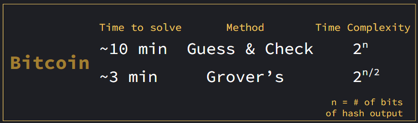

# ⚛️ Quantum Cryptography : Proof of Work

**Team members**: Jenny Chen, Jeffrey Kwan, Seongbin Park, Anastasia Simonova, John Wang

## 📝 Summary
Our team used Quantum Grover’s search to significantly decrease the compute time it takes to do proof-of-work -- technology used by Bitcoin to approve addition of blocks to the blockchain. We use a four-bit system to compare performance of classical vs. quantum proof-of-work. The simplified model demonstrates the impact quantum computers can have with a greater number of qubits at their disposal.

### ⛳ Goal:
Compare Grover’s search with classical “mining” algorithms in obtaining proof-of-work.

## 📼 Presentation Resources:
Slides:https://docs.google.com/presentation/d/13MC5ZwSvS7hK2QC42qkEkkZD4qoqk9ATySAjBLXjt84/edit?usp=sharing

Video:https://drive.google.com/file/d/1cmKet5NuLsIajN_MCnOD0ieizNz3-H31/view?usp=sharing

## 🗺️ Roadmap
1. Classical Proof-of-Work
2. Quantum Implementation
3. Comparison
4. Conclusion

# 🏛️ Classical Proof-of-Work
Classically, proof-of-work is an algorithm that ensures entities have undertaken enough computational work before adding blocks & completing transactions. An example of such an algorithm is SHA256 Hash Algorithm.

In our implementation, we use a parity of our our own hash that utilizes 4 bits to encode information and utilise brute force. The link to our notebook is 
[here](https://github.com/Anastasia-Sim/PoW-QCSA-fa22/blob/main/Classical_PoW.ipynb).

# 🌌 Quantum Implementation
One of the challenges in comparing a classical vs. quantum proof of work algorithm is creating a hash function implementable both in classical and quantum terms. Here is our take:
[Quantum Hash](https://github.com/Anastasia-Sim/PoW-QCSA-fa22/blob/main/QuantumHash.ipynb)

Using the hash created above, we integrate with Grover's search to find a far more superior search algorithm than classical brute force:
[Quantum Proof-of-Work](https://github.com/Anastasia-Sim/PoW-QCSA-fa22/blob/main/Quantum_PoW.ipynb)

# 📊 Comparison
It is unviable to directly benchmark the performance of our Grover search implementation against its classical equivalent, due to the small scale of our circuit (resulting in the theoretical speedup being eclipsed by overhead).
However, as a general benchmark, here's how long bitcoin has set their proof-of-work problem to take, and how long Grover search would take to solve the same problem.

# ✨ Extras
Though these results are exciting, we also tried our hand at a more realistic quantum proof of work circuit that involved nonces (https://coincentral.com/what-is-a-nonce-proof-of-work/). Though we got close to a working implementation, we did not have enough resources at hand to complete. Thus, we have linked it in the extras folder as extra goodies from our quantum exploits!

# 🫶 Thank You!
Big shoutout to the UCLA QCSA for organizing! This was a lot of fun!

## Sources referenced in this project
https://qiskit.org/documentation/ \
https://forkast.news/proof-of-work-what-is-it-bitcoin-halving/ \
https://www.youtube.com/watch?v=bBC-nXj3Ng4 (3Blue1Brown) \
https://www.youtube.com/watch?v=3EUAcxhuoU4 (Binance Academy) \
https://www.youtube.com/watch?v=9V1bipPkCTU (Khan Academy) \
https://blog.gameoflife.co/implementing-a-simple-proof-of-work-algorithm-for-the-blockchain-bdcd50faac18 \
https://arxiv.org/pdf/2202.10982.pdf \ 
https://arxiv.org/pdf/1603.09383.pdf
